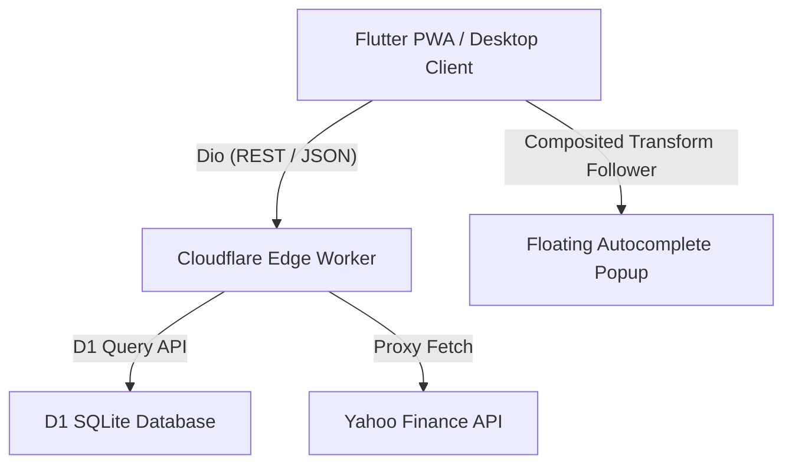

# 🌌 Project Summary: Asset Master

**Asset Master** is a premium, cross-platform, high-performance wealth and asset portfolio management system. It features a modern responsive **Flutter Web PWA** frontend styled with high-fidelity glassmorphism, paired with a robust **Cloudflare Edge Worker** + **D1 SQLite** edge database backend that integrates live-synced Yahoo Finance API feeds.

---

## 🏗️ Architectural Overview



### 1. Edge-Native Backend (Cloudflare Worker & D1)
* **Wrangler Dev Node**: Serves endpoints hot from a local simulation environment at `http://127.0.0.1:8787`.
* **D1 SQLite Database**: Managed by Cloudflare, loaded with structural migrations and pre-seeded database mock portfolios.
* **Yahoo Finance Live Proxy**: 
  * `GET /api/stocks?symbols=AAPL`: Queries real-time charts and price details, returning quotes inside a performant edge cache.
  * `GET /api/stocks/search?q={query}`: Autocomplete search endpoint proxying Yahoo Finance's query service to locate official tickers and exchange assets in milliseconds.

### 2. High-Fidelity Responsive Frontend (Flutter PWA)
* **GetX State Engine**: Implements rapid reactive state updates (`.obs`) and dependency injections.
* **Dio Client**: Integrates standard request/response logging interceptors, automatic connection/receive timeouts (10 seconds), and unified error mappings.
* **Platform Support**: Compiled as an installable standalone web **Progressive Web App (PWA)**, responsive down to mobile views with collapsable sidebar navigation drawers.

---

## ✨ Premium Features & Design Elements

### 🪐 1. High-Fidelity Dark Theme & Glassmorphism
* **AppTheme**: Implements HSL Space Blue (`#090D1A`), Indigo-Cyan brand gradients, and glowing borders.
* **Dynamic Valuation Cards**: Renders glowing borders that dynamically shift between Emerald Green (`#10B981`) and Vivid Red (`#EF4444`) to reflect aggregate portfolio profit and loss.

### 📈 2. Interactive Allocation Chart
* Custom circular **FL Donut Chart** that divides portfolios by ticker weights. Includes tap pointer callbacks and micro-animations to highlight slices.

### 📊 3. Scaled Custom DataTable (Ellipsis-Safe)
* Overhauled column layouts with `FittedBox` scale protection.
* Standardized custom rows inside strict `SizedBox` bounds, added asset name ellipsis constraints, and replaced spacing cells to correct DataTable width intrinsic calculations.

### 🔍 4. Floating Real-Time Autocomplete Search & Live Price Sync
* **Debounced Key Listener**: Registers text changes in the symbol field, triggering search requests only 300ms after the user stops typing to conserve edge request counts.
* **Floating Popup Overlay**: Utilizes Flutter's native `OverlayEntry`, `CompositedTransformTarget`, and `CompositedTransformFollower` to render a floating search candidates list hover-card directly over dialog fields without shifting form alignments.
* **Live Cost-Basis Sync**: Click-selecting a search result auto-populates the symbol and asset name, collapses the overlay, and queries the live market quote in the background to pre-populate the purchase price.
* **Tap-to-Dismiss Gesture**: Wrapped in a translucent `GestureDetector` that collapses the autosearch hover card and closes keyboard focus on any background tap.

---

## 📂 Source Code Landscape

### 🌐 Backend (Cloudflare Worker)
* **[index.ts](file:///Users/chien/Projects/asset-master/backend/src/index.ts)**: Handles REST routers, valuation math, and autocomplete/price proxies.
* **[stocks.ts](file:///Users/chien/Projects/asset-master/backend/src/stocks.ts)**: Implements Yahoo Finance chart data fetching and Cloudflare edge caching.

### 📱 Frontend (Flutter Client)
* **[main.dart](file:///Users/chien/Projects/asset-master/frontend/lib/main.dart)**: Boots MaterialApp, sets Outfit theme, and injects lazy controllers.
* **[api_client.dart](file:///Users/chien/Projects/asset-master/frontend/lib/services/api_client.dart)**: Dio network caller mapping portfolios, assets, search queries, and live quotes.
* **[portfolio_controller.dart](file:///Users/chien/Projects/asset-master/frontend/lib/controllers/portfolio_controller.dart)**: GetX controller syncing live calculations.
* **[dashboard_view.dart](file:///Users/chien/Projects/asset-master/frontend/lib/views/dashboard_view.dart)**: Responsive dashboard layout.
* **[add_asset_dialog.dart](file:///Users/chien/Projects/asset-master/frontend/lib/widgets/add_asset_dialog.dart)**: Input dialog hosting the debounced search overlay.
* **[asset_list_table.dart](file:///Users/chien/Projects/asset-master/frontend/lib/widgets/asset_list_table.dart)**: Sized-constrained adaptive data sheet.

---

## 🛠️ Execution & Deployment Commands

### 1. Launch Backend Server
```bash
# Navigate to backend and run wrangler edge worker
cd backend
npm install
npm run dev
```

### 2. Run Flutter Client in Hot-Reload Mode
```bash
# Launch on Chrome to leverage PWA hot restart
cd frontend
flutter pub get
flutter run -d chrome
```

### 3. Compile Production Installable PWA Web Release
```bash
cd frontend
flutter build web --release
```
Serve the compiled release at `http://localhost:8080` using a quick static file server:
```bash
cd build/web
python3 -m http.server 8080
```
